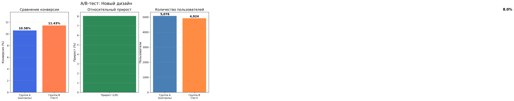
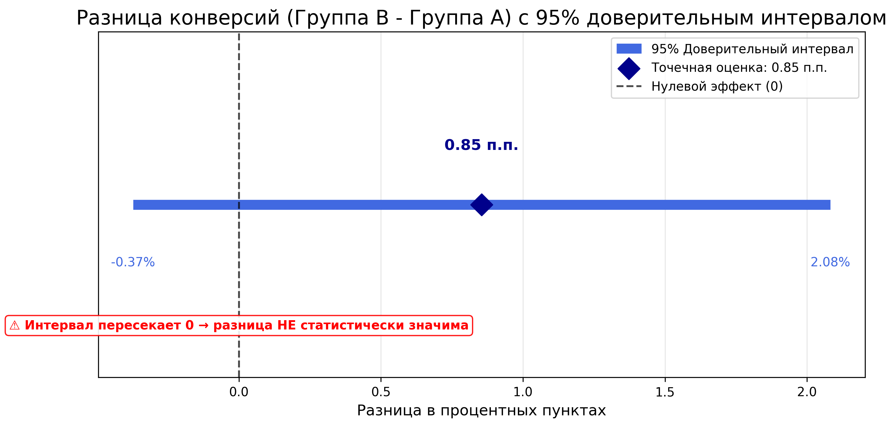
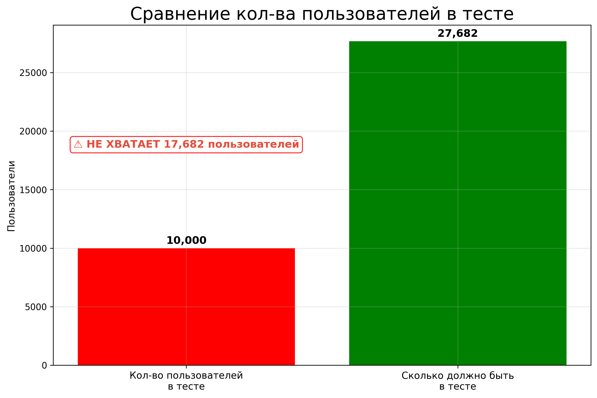

# 📊 A/B-тестирование: Влияние нового дизайна на конверсию

Проект по **A/B-тестированию** в интернет-магазине.  
Цель — проверить гипотезу о том, что **новый дизайн карточки товара** увеличивает конверсию в покупку.

---

## 🧠 ОПИСАНИЕ ПРОЕКТА

Я провёл полный цикл анализа A/B-теста:
1. **Сгенерировал** синтетические данные (10 000 пользователей)
2. **Загрузил** данные в SQLite
3. **Написал SQL-запросы** с CTE для расчёта конверсий
4. **Проверил статистическую значимость** с помощью Z-теста
5. **Рассчитан 95% доверительный интервал** для разницы конверсий
6. **Визуализировал** результаты
7. **Сделал бизнес-выводы** и рекомендации
8. **Рассчитан** необходимый размер выборки (sample size)

---

## 📊 РЕЗУЛЬТАТЫ

| Группа | Конверсия | Пользователей |
|--------|-----------|---------------|
| **A (старый дизайн)** | 10.58% | 5 076 |
| **B (новый дизайн)**  | 11.43% | 4 924 |

- **Абсолютный прирост:** +0.85 п.п.
- **Относительный прирост (Lift):** +8%
- **p-value:** 0.17 (> 0.05) → **результат НЕ статистически значим**

### 📈 Графики

---

## 📈 ДОВЕРИТЕЛЬНЫЙ ИНТЕРВАЛ (95% CI)

**Доверительный интервал** показывает диапазон, в котором с вероятностью 95% находится истинная разница конверсий между группами.

| Параметр | Значение |
|----------|----------|
| Разница конверсий (B - A) | +0.85 п.п. |
| **95% доверительный интервал** | **[-0.37 п.п.; +2.08 п.п.]** |
| Интервал содержит 0? | **Да** ⚠️ |

**Интерпретация:**
- Мы на 95% уверены, что истинная разница конверсий находится между **-0.37%** и **+2.08%**
- Интервал **включает 0%** → разница **не статистически значима**
- 📉 Наихудший сценарий: новый дизайн проигрывает (-0.37%)
- 📈 Наилучший сценарий: новый дизайн выигрывает (+2.08%)

---

## 📐 РАСЧЁТ РАЗМЕРА ВЫБОРКИ (SAMPLE SIZE)

Чтобы обнаружить эффект, нужно было провести тест на большем количестве пользователей.

| Параметр | Значение |
|----------|----------|
| Базовая конверсия | 10.58% |
| Минимальный эффект (MDE) | 1.06 п.п. (10% от базовой конверсии) |
| Уровень значимости (alpha) | 5% |
| Статистическая мощность (power) | 80% |
| **Необходимый размер выборки (на группу)** | **13,841 пользователей** |
| **Всего пользователей** | **27,682** |

---

## 📌 ВЫВОДЫ И РЕКОМЕНДАЦИИ

1.  **📈Результаты:** Новый дизайн (Группа B) показал прирост конверсии на **0.85 п.п. (8%)**.
2.  **⚠️Статистическая значимость:** При p-value = 0.17 (> 0.05), этот прирост **не является статистически значимым**. Он может быть вызван случайностью.
3.  **❌Решение:** На основе текущих данных мы **не можем рекомендовать** внедрение нового дизайна для всех пользователей.
4.  **План действий:**
    *   **🔄Продлить тест:** Набрать выборку до 27 000 пользователей, чтобы получить статистически значимые результаты.
    *   **🎯Сегментировать анализ:** Проверить, как новый дизайн работает на разных сегментах, например, на мобильных пользователях.

---

## 🛠️ ИСПОЛЬЗУЕМЫЕ ТЕХНОЛОГИИ

- **Python 3.14.3**
- **Pandas** — обработка и анализ данных
- **SQLite** — хранение данных
- **Matplotlib** — визуализация
- **Statsmodels** — статистические тесты (Z-тест, расчет sample size)
- **SciPy** — расчёт доверительных интервалов

---

## 🗓️ ПЛАН РАЗВИТИЯ

- [ ] Провести анализ **по сегментам** (мобильные / десктоп)
